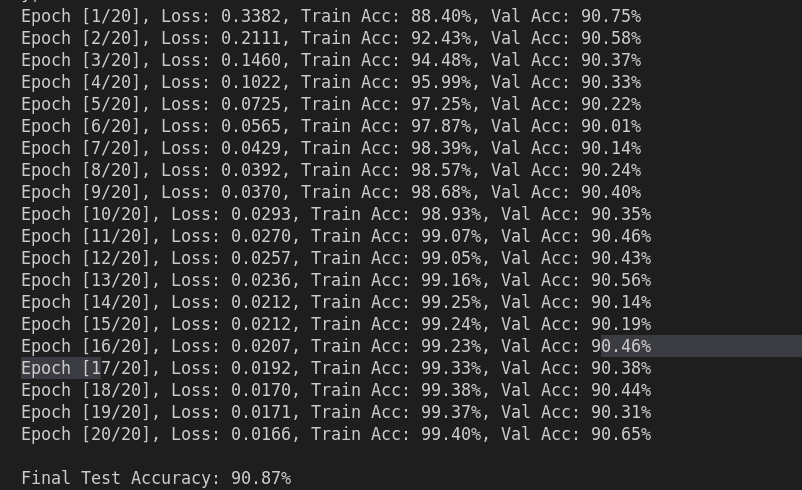

# Project Report: Automatic Tagging System

deployed on https://automatic-tagging-system.onrender.com/

```
curl -X POST "https://automatic-tagging-system.onrender.com/predict_tags" \
     -H "Content-Type: application/json" \
     -d '{"text":"Reuters - Private investment firm Carlyle Group, which has a reputation for making well-timed and occasionally controversial plays in the defense industry, has quietly placed its bets on another part of the market."}'

```

## Objective

The primary objective of this project is to develop an automatic tagging system that can classify news articles into predefined categories using natural language processing (NLP) techniques. The system leverages machine learning models to predict tags based on the content of the articles.

## Methods

### Data Collection and Preparation

The dataset used in this project is the "AG News" dataset, which is a popular text classification dataset available through the Hugging Face `datasets` library. It consists of news articles categorized into four classes: World, Sports, Business, and Sci/Tech.

```python
from datasets import load_dataset

# Load the AG News dataset
dataset = load_dataset("ag_news")
texts = dataset['train']['text']
labels = dataset['train']['label']
```

### Feature Extraction

The system uses TF-IDF (Term Frequency-Inverse Document Frequency) for feature extraction. TF-IDF is a statistical measure that evaluates the importance of a word in a document relative to a collection of documents (corpus).

```python
from sklearn.feature_extraction.text import TfidfVectorizer

class FeatureExtractor:
    def __init__(self, method='tfidf'):
        self.tfidf_vectorizer = TfidfVectorizer(max_features=5000, stop_words='english')

    def extract_features(self, texts):
        return self.tfidf_vectorizer.fit_transform(texts)

feature_extractor = FeatureExtractor(method='tfidf')
X = feature_extractor.extract_features(texts)
```

### Model Development

The model is a neural network implemented using PyTorch. It consists of multiple layers with ReLU activations and dropout for regularization. The model is trained using cross-entropy loss, which is suitable for multi-class classification tasks.

```python
import torch
import torch.nn as nn
import torch.optim as optim

class MultiLabelClassifier(nn.Module):
    def __init__(self, input_dim, num_classes):
        super().__init__()
        self.classifier = nn.Sequential(
            nn.Linear(input_dim, 512),
            nn.BatchNorm1d(512),
            nn.ReLU(),
            nn.Dropout(0.3),
            nn.Linear(512, 256),
            nn.BatchNorm1d(256),
            nn.ReLU(),
            nn.Dropout(0.2),
            nn.Linear(256, num_classes)
        )

    def forward(self, x):
        return self.classifier(x)

# Model training
model_trainer = ModelTrainer(input_dim=X_train.shape[1], num_classes=4)
model_trainer.train(X_train, y_train, X_val, y_val)
```



### Evaluation

The model's performance is evaluated using accuracy, which measures the proportion of correctly predicted instances out of the total instances.

```python
# Evaluate the model
test_metrics = model_trainer.evaluate(X_test, y_test)
print(f"Final Test Accuracy: {test_metrics['accuracy']*100:.2f}%")
```

### Deployment

The trained model is deployed using FastAPI, a modern web framework for building APIs with Python. The API allows users to submit text and receive predicted tags.

```python
from fastapi import FastAPI, HTTPException
import joblib

app = FastAPI(title="Automatic Tagging System")

@app.post("/predict_tags")
async def predict_tags(input_text: TextInput):
    try:
        tagging_service = TaggingService(
            model_path='models/classifier.pkl',
            vectorizer_path='models/vectorizer.pkl',
            tag_classes=tag_classes
        )
        tags = tagging_service.predict_tags(input_text.text)
        return {"tags": tags}
    except Exception as e:
        raise HTTPException(status_code=500, detail=str(e))
```

## Results

The model achieved a final test accuracy of approximately 90.7%, indicating a strong ability to classify news articles into the correct categories. The use of TF-IDF for feature extraction and a neural network for classification proved effective for this task.

### Sample Output

For a given input text, the system predicts the following tags:

```json
{
  "tags": ["World"],
  "raw_text": "Your sample text here..."
}
```

## Conclusion

This project demonstrates the application of NLP techniques and machine learning models to automate the tagging of news articles. The system effectively uses TF-IDF for feature extraction and a neural network for classification, achieving high accuracy. Future work could explore more advanced models, such as transformer-based architectures, to further improve performance.

---

This report provides a detailed overview of the automatic tagging system, covering the objectives, methods, data, and results. It highlights the use of TF-IDF and neural networks in building an effective text classification model.

## Project Setup Instructions

### 1. Create Project Environment

```bash
# Create a new directory
mkdir automatic-tagging-system
cd automatic-tagging-system

# Create virtual environment
python3 -m venv venv
source venv/bin/activate
```

### 2. Install Dependencies

```bash
# Install required packages
pip install -U pip
pip install torch transformers scikit-learn pandas numpy fastapi uvicorn pydantic datasets
```

### 4. Project Files Structure

```
automatic-tagging-system/
│
├── venv/
├── src/
│   ├── data_processor.py
│   ├── feature_extractor.py
│   ├── model.py
│   └── app.py
├── notebooks/
│   └── exploration.ipynb
├── models/
│   ├── classifier.pth
│   └── vectorizer.pkl
├── requirements.txt
└── README.md
```

### 5. Training Script

```bash
# Train the model
python src/train.py
```

### 6. Run API

```bash
# Start FastAPI service
uvicorn src.app:app --reload
```

### 7. Test Endpoint

```bash
# Using curl
curl -X POST "http://localhost:8000/predict_tags" \
     -H "Content-Type: application/json" \
     -d '{"text":"Your sample text here"}'
```


/automatictagging/src$ python train.py
/automatictagging/src$ uvicorn app:app --reload
automatictagging/src$ uvicorn app:app --reload

# Automatic-Tagging-system
